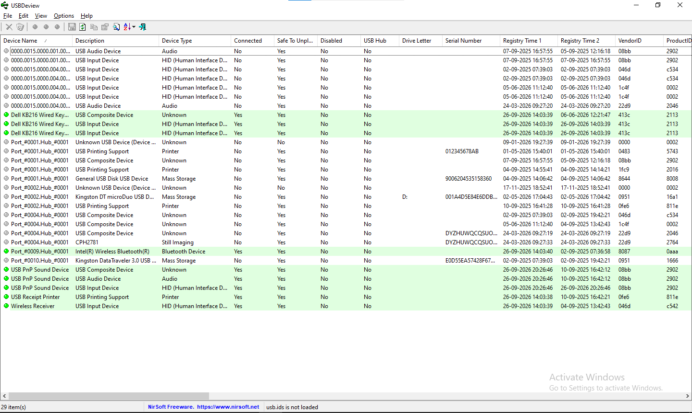

# 💾 Enterprise Disk Imaging & Cryptographic Triage Lab

> **Institutional Provenance:** The workflows, architectures, and advanced enterprise tool testing methodologies documented in this lab were executed during a cybersecurity internship at **Alibi Cyberforensics**. 

---

## 📌 Project Overview
This repository showcases tactical forensic data acquisition, bit-stream disk mirroring, and cryptographic integrity validation workflows. It demonstrates industry-standard methodologies for preserving volatile data, capturing physical storage media without altering metadata, and analyzing peripheral endpoint tracking vectors.

---

## 🛠️ Tactical Toolkit & Forensics Stack
- **Data Acquisition & Imaging:** FTK Imager (AccessData), EnCase Forensic, Magnet AXIOM Imaging Core
- **Triage & Endpoint Footprinting:** USBDeview (NirSoft)
- **Target Evidence Containers:** Raw DD Images, E01 (Expert Witness Format) evidence structures

---

## 🔍 Case Study: Enterprise Hardware Peripheral Footprinting
Investigated persistent configuration database tracking artifacts on the host architecture to reconstruct a comprehensive lineage of historical and current physical hardware peripheral insertions.



### *Key Evidence Discovered from the Triage Vector:*
*   **Active Peripheral Ingestion:** Identified live system connections including a **USB PnP Sound Device** and an integrated **Intel(R) Wireless Bluetooth(R)** module mapping a persistent hardware **VendorID of `8087`** and a **ProductID of `0aaa`**.
*   **Historic Storage Tracks:** Extracted registry residue metrics detailing historical connections for structural data mass storage assets, specifically tracking a **Kingston DataTraveler 3.0** (`E0D55EA5...`) and a **Kingston DT microDuo** partition mapped to **Drive D:** (`001A4D5E...`).
*   **Temporal Precision:** Isolated exact, volatile registry time synchronization markers down to the second, validating localized user interaction contexts.

---

## 📊 Enterprise Acquisition Pipeline (Conceptual Blueprint)
```text
[ Compromised Host System ] 
             │
             ▼ (Live Triage & Asset Analysis via USBDeview)
[ Target Device Identified ] 
             │
             ▼ (Hardware Write-Blocker Isolation / Bit-Stream Capture)
[ Raw DD / E01 Evidence Container Generation via FTK Imager ]
             │
             ▼ (Deep Forensic Analysis & Artifact Extraction)
[ Magnet AXIOM / EnCase Enterprise Ingestion Platforms ]
```
